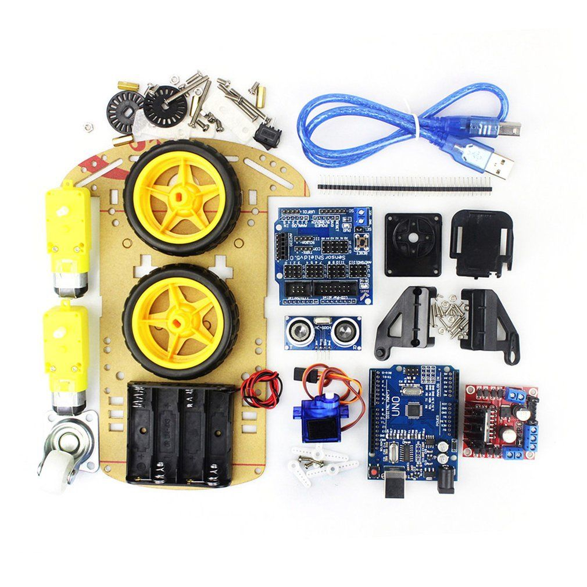

# buggy-bot

This is a basic repo with both an Android APP and an Arduino sketch that allows simple communication between two devices.

Why not use MQTT do you ask? because this is a lot smaller and easier to implement, this will work on an Arduino micro with 2kb of memory and not eat up all your resources.

The reason for this repository is to help people to build a basic robot buggy that has direct control from a remote for sumo-battles.



The way this is structured, you can make modifications to just the Arduino code to utilise the Android app as a simple remote control and get some stuff done easily.

Out of the box the buggy code will be able to drive forward **or** backward **or** rotate clockwise **or** anticlockwise.

## The android app

The Android app has a simple land-scape UI with a directional stick and a few buttons.

It also has a communications protocol called `symmetry.serial` with heart-beat and auto reconnection.

## The Arduino Sketch

The Arduino Sketch has the communication protocol to match the android app and the method calls for the directional stick code and the extra buttons. The code to execute on these things is all stubbed out.

## Dependencies

The arduino code needs to have the following modules cloned into your library folder:

* Symmetry serial module
  * Does all the arduino-side message parsing
  * [symmetryserial.arduino](https://github.com/mrkoz/symmetryserial.arduino)
* Modified timer.h module
  * Handles doing things in symmetry serial on a timer-based schedule
  * This fork allows the modification of the timer intervals
  * [Timer](https://github.com/mrkoz/Timer)

## How to use

### Fork

You can just fork this repo and do PR's on changes if you want to make everything exactly the same.

### Make it yours - copy the repo

If you want to make changes to the code that aren't goin to be pushed upstream, you might as well re-create your own repo :)

First thing you need to do is copy the code out into your own repo. You can do this by following this process:

1. Clone down this repo to a different place
2. Delete the `.git` folder in the cloned repo
3. Create your own repo somewhere and clone it **or** just `git init`
4. Move the files from this repo into your new cloned repo
5. `git add` all the files you just moved into your new repo folder
6. `git commit` the files

Example script - use with care!

```bash
git clone git@bitbucket.org:misterkoz/symmetry-buggy-bot.git
rm -rf ./symmetry-buggy-bot/.git
MYREPONAME=my-buggy-bot
mkdir ${MYREPONAME}
cd ${MYREPONAME}
git init
git checkout -b master
cp -R ../symmetry-buggy-bot/* ./
cp -R ../symmetry-buggy-bot/.gitignore ./ # for the gitignore file
git add . && git commit -m "moved repo to make it mine"
# optional add your remote
git remote add origin git@myremote:path/thing
git push origin master
```

## How to use - Arduino

The code expects that you have a serial port wired up to a Bluetooth device.

### Weird indentation and comments

The code is indented with 2 spaces and has a non-standard indention increment. This is so code-folding works nicely in visual studio code, sublime and other text editors with basic block detection.

Comments are sectional and verbose.

The reason for the weird indentation is that Arduino code is simplified syntax and to retain the simplified syntax you need to have everything in one file which means that some of my robots have 5-6000 lines of code and without collapsible blocks in an UI is very tiring...

If you don't like it, I don't care, change it and be happy.

### Get the right serial port and baud rate

Your baud rate could be any standard baud rate, in general `9600` is a good starting amount. Speeding it up wont really do much because this protocol isn't very big so the time it takes to pipe a string correctly is longer than the serial transaction takes at any baud rate - it's worth while experimenting on higher board rates.

Update this line to match your serial port, specifically the `&Serial3` **Note:** you need the ampersand.

```C++
  #define BTBAUDRATE 9600
  #define BTHEARTBEATRATE 2000
  SymmetrySerial bluetoothComms(&Serial3, BTBAUDRATE, BTHEARTBEATRATE);
```

### Make the code do something

The `doing the actual stuff section` is where the basic drive/execution works.

To handle what the directional stick does modify the function `commandReceivedDrive` - it receives 2 values between 0 and 200:

* `direction1` is directional value
  * 0-99 is reverse strength
  * 100 is no directional value
  * 101-200 is forward strength
* `direction2` is rotational value
  * 0-99 is left strength
  * 100 is no rotational value
  * 101-200 is right strength

To do something a little extra, modify the function `commandReceivedExec`. It's just an execution router; some ideas:

* The tipper - hook up a servo to a digger bucket and pre-program some values for up and down
  * function 1 could lift a tipper to the top
  * function 2 could drop a tipper to the floor
* The grabber - make up an arm that grabs
  * function 1 could close the grip
  * function 2 could open the grip

## How to use - Android

It's pretty self-contained :) just compile it and deploy.

## Challenges

It wouldn't be a free-bee without a challenge or 11.

1. Deploy both the arduino and the android code
2. See an instruction sent from the android device to the arduino device in the debug console
3. Make it drive fwd/reverse
4. Make it turn and drive forward/reverse **note** this requires changing the android app too

### more advanced challenges

1. Add a raspberry pi and a camera
2. Make it stream video to a web browser
3. Make it follow a line using computer vision

## Future stuff

The `symmetry.serial` protocol doesn't have a python variant or a variant that works on raspberry pi, the next version will and will be able to be implemented to drive the robot from a raspberry pi if needed.

Realistically if you were to do something a bit advanced, you'd use ROS and the ROS-Arduino bridge and the `symmetry.serial` protocol wouldn't be needed.
